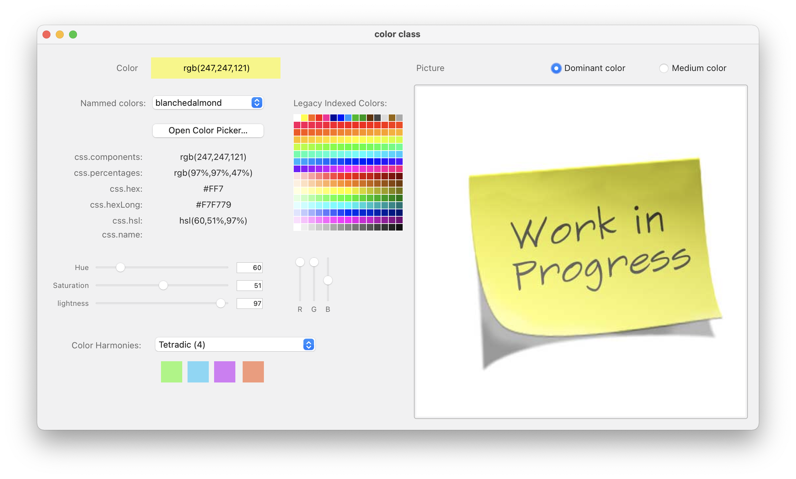

# Color-with-Classes

I was led to develop, for the [4D Go mobile](https://blog.4d.com/tag/go-mobile/) project editor, a management of colors and their conversions from one system to another, the calculation of color harmonies and even the detection of the dominant color of an image. This project is the result of this research in the form of 2 classes: [color](Documentation/Classes/color.md) & [bmp](Documentation/Classes/bmp.md) and a test form. 



## Features

- **Color conversions**: RGB ↔ HSL ↔ 4D color format ↔ CSS (hex, rgb(), hsl(), named colors)
- **Color harmonies**: Calculate complementary, analogous, triadic, tetradic, and monochromatic color schemes
- **System colors**: Cross-platform (macOS/Windows) highlight color detection
- **Image analysis**: Extract dominant and medium colors from BMP images
- **Font contrast**: Automatically determine best text color (black/white) for readability on any background
- **Modern syntax**: Uses [direct typing](https://developer.4d.com/docs/Concepts/dt-object-collection/) with object `{}` and collection `[]` literals

## Classes

### [color](Documentation/Classes/color.md)
Manages color representations, conversions, harmonies, and utilities.

### [bmp](Documentation/Classes/bmp.md)
Analyzes BMP images for color extraction and analysis.

## Usage

```4d
// Create a color from various sources
var $color := cs.color.new(0x00FF8040)        // 4D color
var $color := cs.color.new("#FF8040")         // Hex CSS
var $color := cs.color.new("rgb(255,128,64)") // RGB CSS
var $color := cs.color.new({red: 255; green: 128; blue: 64})  // RGB object
var $color := cs.color.new("coral")           // Named color

// Get the system highlight color
var $highlightColor := cs.color.new("highlightColor")  // macOS + Windows

// Work with color harmonies
var $complementary := $color.getMatchingColors(kMatchingSchemeComplementary)
var $palette := $color.getMatchingColors(kMatchingSchemeTetradic)

// Determine readable text color
var $textColor := $color.fontColor()  // Returns "black" or "white"
```

## Contributing

I strongly encourage you to enrich this project through pull request. This can only benefit the [4D developer community](https://discuss.4d.com/search?q=4D%20for%20iOS). 

`Enjoy the 4th dimension`
